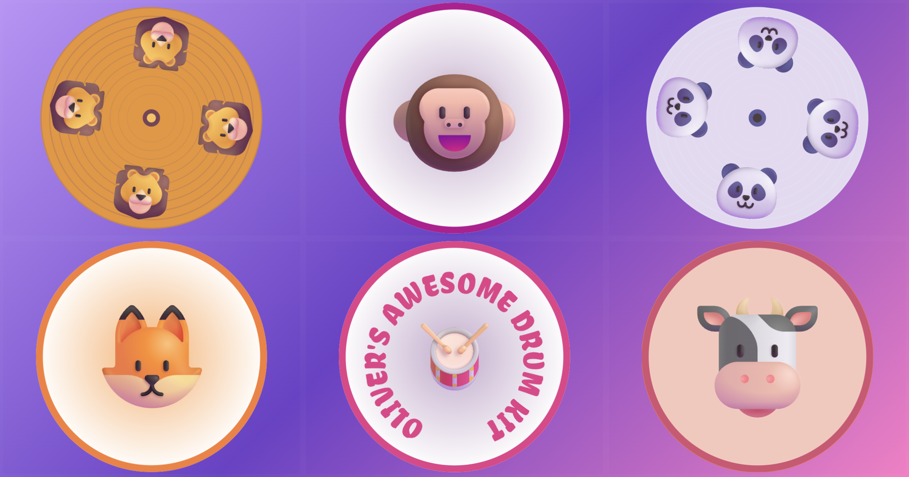

# A Drum Kit for Oliver



A browser-based drum kit built with HTML, CSS, and JavaScript, made as a fun interactive toy for my grandson Oliver.

Live at [drum-kit.philipnewborough.co.uk](https://drum-kit.philipnewborough.co.uk)

## Features

- **6 drum instruments** — crash cymbal, hi-hat, tom, snare, bass drum, and floor tom
- **Touch and click support** — works on mobile, tablet, and desktop
- **Visual feedback** — sparkle burst and expanding ring animations on every hit
- **Animated backgrounds** — randomly cycles through four vibrant colour themes on each hit
- **Progressive Web App (PWA)** — installable and fully usable offline via a service worker

## Tech Stack

- Vanilla HTML, CSS, and JavaScript
- [Howler.js](https://howlerjs.com/) for cross-browser audio playback
- Service Worker for asset pre-caching and offline support
- Web App Manifest for PWA installability

## Project Structure

```
public/
├── index.html
├── manifest.json
├── sw.js
├── audio/         # MP3 samples for each instrument
├── css/           # Styles (reset + main)
├── img/           # SVG instrument graphics and app icons
└── js/
    ├── main.js    # App logic
    └── vendor/    # Howler.js library
```

## Getting Started

No build step required. Serve the `public/` directory with any static file server, for example:

```bash
npx serve public
```

Then open `http://localhost:3000` in your browser.

## License

See [LICENSE](LICENSE).
